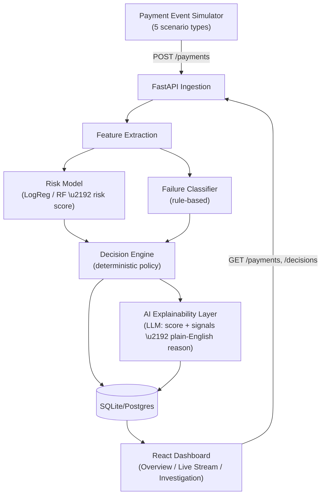

# PaySentinel AI — Architecture Document
### Intelligent Payment Risk, Failure Recovery & Decision Engine
**Razorpay AI Buildathon 2026 — Track: AI Risk Manager**

---

## 1. The core idea, in one line

Most systems answer *"what happened to this payment?"* PaySentinel AI answers *"what should happen next?"* — it takes every payment event, scores its risk, classifies why it failed (if it failed), and issues a policy-controlled decision with a plain-English explanation, instead of a flat success/fail message.

---

## 2. Scope for this build (the 5-day MVP — do not exceed this)

**In scope:**
- Payment event simulator (5 scenario types)
- Risk scoring model (Logistic Regression vs. Random Forest, compared)
- Rule-based failure classifier
- Deterministic decision/policy engine
- AI explainability layer (LLM-generated reasoning)
- 3-page dashboard: Overview, Live Stream, Investigation

**Explicitly out of scope until after submission:**
- Anomaly detection (Isolation Forest) — a standalone scorer exists
  (`ml/train_anomaly.py`, `app/engine/anomaly.py`) but is **deliberately not
  wired into the pipeline or the decision engine**; enabling it is a later call
- Merchant analytics charts, alert system, separate Recovery Center page
- NetworkX transaction-graph / AML pattern detection — this is the *Barclays extension* (FinSentinel), not part of this submission

---

## 3. Tech stack

| Layer | Choice | Why |
|---|---|---|
| Backend | FastAPI (Python) | Fast to build, async-friendly, auto-generates API docs you can show judges |
| ML | scikit-learn (Logistic Regression + Random Forest) | Quick to train and compare, easy to explain live in the pitch |
| Database | SQLite for the build (zero setup, no server to manage under time pressure) → swap to PostgreSQL later for the Barclays/FinSentinel extension | Removes a whole category of setup friction this week; the schema is designed to migrate cleanly |
| AI explainability | One LLM API call (Claude or OpenAI) per flagged decision, given the risk score + triggered signals as structured input, returns a 1-2 sentence natural-language reason | This is what makes it an *AI* system, not just an ML+rules app — keep the call small and cheap, not a full chatbot |
| Frontend | React (your existing strength) | 3 pages, polling-based "live" feed — no need for WebSockets this week |
| Deployment | Backend: Render/Railway. Frontend: Vercel | Both have free tiers, fast to stand up |

---

## 4. System architecture



**Flow in plain words:**
1. The simulator posts a payment event (mix of success, temporary failure, fraud, repeated failure, suspicious behavior) every few seconds.
2. Features are extracted (amount vs. customer history, device change, failed-attempt count, payment method, time of day).
3. The **risk model** outputs a fraud/risk probability. The **failure classifier** (rule-based, not ML — it doesn't need to be) categorizes *why* a failed payment failed: temporary / payment-method / user-related / suspicious.
4. Both signals feed the **decision engine** — a deterministic policy layer (if/elif rules over the ML output), which is the design point worth explaining to judges: *AI recommends, a controlled policy decides* — you don't want a probabilistic model making uncontrolled financial calls.
5. The decision engine's output goes to the **AI explainability layer**, which turns the raw signals into a short, readable "why" — this is your one deliberate LLM touchpoint.
6. Everything is persisted, and the dashboard reads from the API to show it as a live feed.

---

## 5. Database schema

```sql
CREATE TABLE payment_events (
    id INTEGER PRIMARY KEY AUTOINCREMENT,
    transaction_id VARCHAR(20) UNIQUE NOT NULL,
    customer_id VARCHAR(20) NOT NULL,
    merchant_id VARCHAR(20),
    amount NUMERIC(12,2) NOT NULL,
    payment_method VARCHAR(20),
    bank VARCHAR(50),
    device_id VARCHAR(20),
    status VARCHAR(20),              -- SUCCESS | FAILED
    failure_reason VARCHAR(50),
    event_time TIMESTAMP NOT NULL,
    created_at TIMESTAMP DEFAULT CURRENT_TIMESTAMP
);

CREATE TABLE risk_decisions (
    id INTEGER PRIMARY KEY AUTOINCREMENT,
    event_id INTEGER REFERENCES payment_events(id),
    risk_score NUMERIC(5,4),
    failure_category VARCHAR(30),    -- temporary | payment_method | user_related | suspicious | NULL
    decision VARCHAR(30),            -- APPROVE | RETRY | OFFER_ALTERNATIVE | VERIFY | HOLD
    recovery_probability NUMERIC(5,4),
    explanation TEXT,                -- LLM- or template-generated plain-English reason
    -- Day 3 additions (nullable, additive — see run_light_migrations()):
    explanation_source VARCHAR(20),  -- llm | template
    recommended_action VARCHAR(120),
    model_name VARCHAR(50),          -- which risk model scored this event
    features_json TEXT,              -- engineered feature snapshot the engine saw
    signals_json TEXT,               -- human-readable triggered signals
    created_at TIMESTAMP DEFAULT CURRENT_TIMESTAMP
);
```

(Same shape carries forward cleanly into FinSentinel's `transactions` / `risk_assessments` / `alerts` tables later — this is deliberate, so the Barclays extension is a schema *addition*, not a rewrite.)

The Day 3 columns are stored so the Investigation page can show *exactly* what
the engine saw — the feature row, the signals, the model, and whether the
explanation came from the LLM or the template fallback. `features_json` /
`signals_json` are JSON strings for the MVP; they become real columns/tables in
the Postgres migration.

---

## 6. Decision engine logic (the differentiator to nail)

```python
def decide(risk_score, failure_category, customer_history_good):
    if risk_score > 0.9:
        return "HOLD"
    elif failure_category == "temporary" and risk_score < 0.3:
        return "RETRY"
    elif failure_category == "payment_method" and customer_history_good:
        return "OFFER_ALTERNATIVE"
    elif 0.3 <= risk_score <= 0.9:
        return "VERIFY"
    else:
        return "APPROVE"
```

Be ready to say this sentence in the pitch, close to verbatim: *"The ML model produces a probability, but the final action is controlled by a deterministic policy — I don't want a probabilistic model making uncontrolled financial decisions."* That single sentence signals engineering maturity beyond "I trained a model."

`app/engine/decision_engine.py` implements `decide()` line-for-line as above.
One operational refinement is applied in `app/engine/pipeline.py`, not in
`decide()`: the policy's fall-through is `APPROVE`, which only makes sense for a
payment that actually succeeded, so a **failed** payment that would otherwise be
`APPROVE` (not risky, not a method problem) is returned as `RETRY` instead.
`decide()` itself stays faithful to this doc.

### 6a. Recovery probability

`recovery_probability` (the doc named the column but left it open) is a
transparent heuristic in `app/engine/recovery.py`, deliberately *not* a second
model: a base recoverability rate per failure category (`temporary` 0.90 →
`suspicious` 0.15), scaled down by the risk score and by any run of recent
failed attempts, nudged up for customers with an established good history,
clamped to `[0.01, 0.99]`. `None` for a payment that didn't fail. Easy to swap
for a learned estimate (historical retry-success rate per category) later
without touching the decision engine.

### 6b. Feature extraction

The Day 2 model trains on engineered features; at request time
`app/engine/feature_extractor.py` recomputes them from the customer's actual
prior events (typical spend, usual device/method, consecutive failed-attempt
streak, hour-of-day using the same 06:00–23:00 boundary as the training
generator). A customer with no history gets neutral values (ratio 1.0, nothing
flagged new) — a deliberate cold-start choice.

### 6c. Explainability layer

`app/engine/explainer.py` is the one deliberate LLM touchpoint. It is **off by
default** (`PAYSENTINEL_USE_LLM=1` to enable; model via `PAYSENTINEL_LLM_MODEL`,
default `claude-opus-5`) and *always* has a deterministic template fallback, so
ingestion never blocks on the network and the whole system — tests included —
runs with no API key. The call is small (≤200 tokens, 8s timeout), takes the
structured signals as input, and returns 1–2 factual sentences. The response
records `explanation_source` so the dashboard can show which path produced it.

---

## 7. API design

| Endpoint | Method | Purpose |
|---|---|---|
| `/payments` | POST | Ingest a payment event (called by the simulator); runs the risk pipeline inline |
| `/payments` | GET | List recent events (`limit` 1–500, `offset`) |
| `/decisions` | GET | List recent decisions (`limit`, `offset`, `?decision=HOLD` filter) with risk score, category, action |
| `/decisions/{id}` | GET | Full detail for the Investigation page: event + risk score + explanation + recovery probability + triggered signals + feature snapshot |
| `/stats/summary` | GET | Counts for the Overview page (total, success, failed, high-risk, revenue at risk, decision breakdown) |
| `/health` | GET | Readiness probe — DB reachable + risk model loaded (503 if not) |

---

## 7a. Model performance (Day 2 model, retrained during Day 3 hardening)

Held-out 20% split, ~14% positive rate. Leading metric is PR-AUC (accuracy is
meaningless at this imbalance).

| model | precision | recall | F1 | PR-AUC | ROC-AUC |
|---|---|---|---|---|---|
| Logistic Regression (baseline) | 0.64 | 0.86 | 0.74 | 0.87 | 0.93 |
| **Random Forest** (selected) | **0.90** | **0.87** | **0.88** | **0.89** | 0.93 |

Earlier the Random Forest was a *perfect* separator (PR-AUC 1.0) — a sign the
synthetic data was too clean, not that the model was good. Fixed in
`ml/generate_training_data.py` by making the class distributions genuinely
overlap on every feature (card-testing fraud with small amounts; fraud/ATO from
the customer's usual device; legit big-ticket buys from new devices; short
failure runs before a legit success) plus ~2% symmetric label noise. The Random
Forest now beats the linear baseline on precision (0.90 vs 0.64) at equal
recall, which is the honest version of the "why not just logistic regression"
answer.

Pipeline throughput is ~10 events/s (~85 ms/event, almost entirely the
single-row `RandomForestClassifier.predict_proba`), measured by
`scripts/loadtest_pipeline.py` — comfortably ahead of the simulator; batch
scoring or a smaller forest is the lever if that ever changes.

---

## 8. Dashboard (3 pages only)

Stack: Vite + React + react-router, no UI framework — a hand-built design
system (`src/styles/tokens.css`) so it reads as designed, not generated. One
calm blue accent (not the default indigo/violet), a warm-white canvas, status
colours reserved for decision semantics, `tabular-nums` for money. Data comes
from a single `usePolling` hook; no WebSockets.

1. **Overview** (`/`) — stat tiles (total payments, success rate, failed,
   flagged, revenue at risk), a "decisions by action" horizontal breakdown, a
   throughput sparkline, and a recent-activity list. Polls every 5s.
2. **Live Stream** (`/stream`) — the decision feed, newest first; new rows
   animate in (keyed by decision id, so only genuinely new rows animate);
   filter pills per action; a coloured left rail + `StatusChip` per row; click →
   Investigation. Polls every 3s.
3. **Investigation** (`/investigation/:id`) — the screen-record page: the
   verdict + recommended action, a risk-score meter with band, the **AI
   explanation** with an `llm` / `template` badge, the triggered signals, the
   feature snapshot the model scored on, and the payment + decision record.
   `/investigation` with no id lists what needs attention (HOLD / VERIFY) plus
   an open-by-id box.

Deploy: backend → Render (`backend/render.yaml`), frontend → Vercel
(`frontend/vercel.json`). Render's filesystem is ephemeral, so the backend
re-seeds ~140 scored events on each boot (`app/seed.py`, lifespan). Frontend
reads `VITE_API_BASE_URL` at build time; CORS is `*` unless
`PAYSENTINEL_CORS_ORIGINS` is set. Full runbook: `DEPLOY.md`.

---

## 9. Folder structure

```
paysentinel/
├── backend/
│   ├── app/
│   │   ├── main.py
│   │   ├── models/
│   │   │   └── risk_model.py       # load + predict
│   │   ├── engine/
│   │   │   ├── failure_classifier.py
│   │   │   ├── decision_engine.py
│   │   │   └── explainer.py        # LLM call
│   │   └── db/
│   │       ├── database.py
│   │       └── crud.py
│   ├── ml/
│   │   ├── train.py
│   │   └── saved_model.pkl
│   ├── simulator/
│   │   └── simulate_payments.py
│   └── tests/
│       ├── test_decision_engine.py
│       └── test_failure_classifier.py
└── frontend/
    └── src/
        ├── pages/
        │   ├── Overview.jsx
        │   ├── LiveStream.jsx
        │   └── Investigation.jsx
        └── components/
```

---

## 10. Day-by-day (recap, matches the plan already agreed)

| Day | Deliverable |
|---|---|
| 1 | Repo + simulator generating all 5 scenario types, posting to a working ingestion endpoint |
| 2 | Risk model trained and compared (LogReg vs RF) + rule-based failure classifier |
| 3 | Decision engine + LLM explainability layer, both wired to real outputs |
| 4 | 3-page dashboard, deployed live |
| 5 | Pitch video, this doc finalized, repo polish, submit |

---

Ready to start Day 1 — the simulator and repo skeleton — whenever you are.
