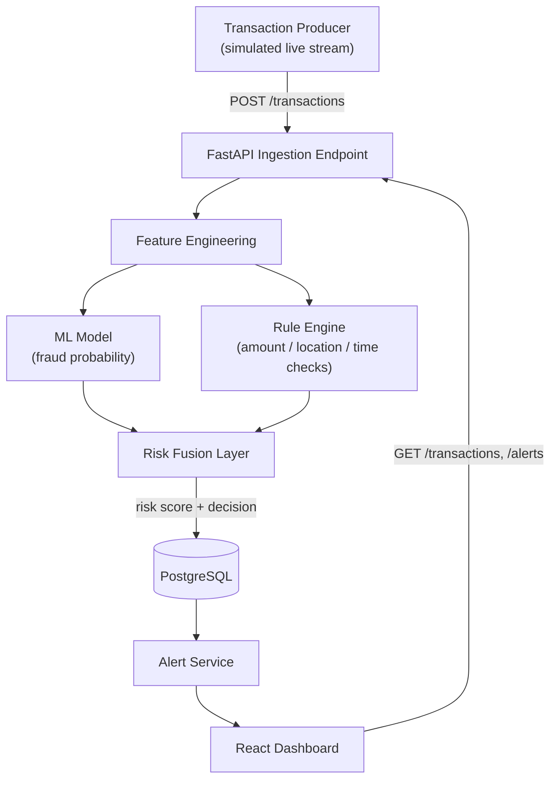

# FinSentinel — Technical Design Document
### Real-Time Financial Crime Detection & Risk Monitoring Platform

---

## 1. What this project actually is

A backend service that receives transactions (simulated as a live stream), scores each one for fraud risk using both a trained ML model and a rule engine, fuses those two signals into a final risk decision, and surfaces flagged transactions on a live analyst dashboard where you can drill into *why* something was flagged.

The point isn't "I trained a classifier." It's "I built a small but real fraud-monitoring system" — that's the sentence that survives a technical interview.

---

## 2. Success criteria (what "done" means)

You're done with the core (Phase 1) when all of this is true, not before:

- [ ] A transaction producer generates realistic transactions on an interval
- [ ] Each transaction is scored by a trained ML model (probability of fraud)
- [ ] Each transaction is independently checked against rule-based conditions
- [ ] A risk fusion step combines both into one final risk score + decision
- [ ] Flagged transactions are persisted to a database with the *reasons* they were flagged
- [ ] A React dashboard shows live transaction volume, alert counts, and a drill-down view per flagged transaction
- [ ] At least a handful of real unit tests exist and pass
- [ ] It's deployed somewhere with a live link (not just `localhost`)

---

## 3. Tech stack — and why each piece

| Layer | Choice | Why |
|---|---|---|
| ML | scikit-learn (Logistic Regression baseline) + XGBoost (or Random Forest) | Fast to train, well-understood, easy to explain in an interview — no need for deep learning here |
| Imbalance handling | `imbalanced-learn` (SMOTE) or class-weighting | The dataset is ~0.17% fraud; naive training gives you a useless model |
| Backend | FastAPI (Python) | Async-friendly, plays natively with your ML stack, auto-generates OpenAPI docs (nice to show), minimal boilerplate |
| Database | PostgreSQL | Relational, transaction-shaped data fits it naturally, and it's the DB banks actually use — stronger signal than Mongo here |
| Frontend | React (reuse your existing strength) | Dashboard: live feed, charts, alert drill-down |
| Streaming simulation | A simple Python producer script (loop + `time.sleep` + POST to API) | Don't reach for Kafka — you don't need it, and "why Kafka?" is a question you don't want to be caught without a real answer to |
| Testing | `pytest` | Standard, simple, and this is one of the skills you actually want to make *true* by building it |
| Deployment | Backend on Render/Railway, frontend on Vercel | Both have generous free tiers, quick to set up |

---

## 4. System architecture



**Flow in plain words:**
1. The producer sends a transaction to the API every few seconds (mix of normal and synthetically "suspicious" ones so your demo has something to show).
2. The API extracts features and runs them through the ML model → gets a fraud probability.
3. In parallel, the rule engine checks hard-coded conditions (e.g. amount > ₹50,000 **and** new location **and** unusual hour).
4. The fusion layer combines both signals into one final decision (e.g. weighted score, or "flag if either signal crosses its threshold").
5. Every transaction (and its score/reasons) is stored in Postgres.
6. The dashboard polls or fetches from the API to show live counts and lets you click into any flagged transaction to see *why* it was flagged.

---

## 5. Database schema (PostgreSQL)

```sql
CREATE TABLE transactions (
    id SERIAL PRIMARY KEY,
    transaction_ref VARCHAR(20) UNIQUE NOT NULL,
    amount NUMERIC(12,2) NOT NULL,
    merchant VARCHAR(100),
    location VARCHAR(100),
    txn_time TIMESTAMP NOT NULL,
    account_id VARCHAR(50) NOT NULL,
    created_at TIMESTAMP DEFAULT now()
);

CREATE TABLE risk_assessments (
    id SERIAL PRIMARY KEY,
    transaction_id INTEGER REFERENCES transactions(id),
    ml_fraud_probability NUMERIC(5,4),
    rule_flags TEXT[],              -- e.g. {'unusual_amount','new_location'}
    final_risk_score NUMERIC(5,4),
    decision VARCHAR(20),           -- 'normal' | 'suspicious' | 'fraud'
    created_at TIMESTAMP DEFAULT now()
);

CREATE TABLE alerts (
    id SERIAL PRIMARY KEY,
    transaction_id INTEGER REFERENCES transactions(id),
    reason_summary TEXT,
    status VARCHAR(20) DEFAULT 'open',  -- 'open' | 'reviewed' | 'dismissed'
    created_at TIMESTAMP DEFAULT now()
);
```

This alone is worth a resume line: *"Designed a normalized PostgreSQL schema separating raw transactions, ML/rule risk assessments, and alert lifecycle state."*

---

## 6. The ML component

**Dataset:** Kaggle's "Credit Card Fraud Detection" dataset (~284,807 transactions, 492 fraud, features V1–V28 are PCA-anonymized, plus `Time` and `Amount`).

**Steps:**
1. **EDA first** — look at the class imbalance directly (plot it), understand `Amount` distribution for fraud vs. non-fraud.
2. **Train/test split** — stratified, so your test set keeps the same tiny fraud ratio as reality.
3. **Baseline model** — Logistic Regression with `class_weight='balanced'`. This is your "I understand the simple case first" story.
4. **Stronger model** — XGBoost or Random Forest, tuned lightly (don't over-engineer this — a grid search over 3-4 params is enough).
5. **Imbalance handling** — try SMOTE on the training set only (never on test data — that's a data leakage mistake worth knowing how to explain).
6. **Evaluation — this is the part interviewers actually probe:**
   - Do **not** report accuracy as your headline metric (99.8% accuracy by predicting "not fraud" every time is meaningless).
   - Report **precision, recall, F1, and AUC-PR** (precision-recall curve area — more informative than ROC-AUC on imbalanced data).
   - Be ready to explain the **precision/recall tradeoff** in plain terms: "if I lower the threshold, I catch more fraud but flag more false alarms — for a bank, missing fraud is worse than an extra manual review, so I'd bias toward higher recall."
7. **Serialize the model** (`joblib` or `pickle`) so FastAPI can load it at startup, not retrain per request.

---

## 7. The rule engine

Keep it simple and legible — a handful of interpretable conditions, e.g.:

```python
def check_rules(transaction):
    flags = []
    if transaction.amount > 50000:
        flags.append("unusual_amount")
    if transaction.location not in known_locations_for(transaction.account_id):
        flags.append("new_location")
    if not (6 <= transaction.txn_time.hour <= 23):
        flags.append("unusual_hour")
    return flags
```

**Why this matters for the interview:** it shows you understand that real fraud systems combine interpretable rules with ML — rules catch known patterns instantly and cheaply, ML catches subtler patterns rules would miss. Saying this sentence out loud in an interview is worth more than any one line of code.

---

## 8. Risk fusion logic

Simplest defensible approach — weighted combination, thresholded into three tiers:

```python
def fuse_risk(ml_probability, rule_flags):
    rule_weight = min(len(rule_flags) * 0.2, 0.6)
    final_score = (0.7 * ml_probability) + (0.3 * rule_weight)

    if final_score > 0.75:
        decision = "fraud"
    elif final_score > 0.4:
        decision = "suspicious"
    else:
        decision = "normal"
    return final_score, decision
```

(The exact weights are a design choice you get to justify in an interview — that's a feature, not a gap. "I weighted ML higher because it captures patterns rules can't, but rules still meaningfully move the score because they catch known red flags instantly.")

---

## 9. API design (FastAPI)

| Endpoint | Method | Purpose |
|---|---|---|
| `/transactions` | POST | Ingest a new transaction (called by the producer) |
| `/transactions` | GET | List recent transactions (paginated) |
| `/alerts` | GET | List open alerts, most recent first |
| `/alerts/{id}` | GET | Full detail: transaction + ML score + rule flags + reasoning |
| `/alerts/{id}/status` | PATCH | Mark an alert reviewed/dismissed (nice touch — shows you thought about the analyst workflow, not just the ML) |
| `/stats/summary` | GET | Counts for the dashboard overview (total processed, normal/suspicious/fraud breakdown) |

---

## 10. Frontend dashboard (React)

**Pages/components:**
- **Overview** — live counters (processed / normal / suspicious / fraud), a simple line chart of transactions-per-minute
- **Alerts feed** — table of recent flagged transactions, risk score, decision tier
- **Investigation view** — click an alert → see transaction details, ML probability, which rules triggered, and the final fused score/decision

Poll the `/stats/summary` and `/alerts` endpoints every few seconds to simulate "live" — you don't need WebSockets for this to feel real-time enough for a demo.

---

## 11. Testing strategy (pytest)

Don't aim for exhaustive coverage — aim for a handful of *meaningful* tests you can talk through:
- Rule engine: a transaction with amount > ₹50,000 triggers `unusual_amount`
- Risk fusion: a high ML probability + multiple rule flags produces `"fraud"`, not `"normal"`
- API: `POST /transactions` with valid payload returns 201 and a persisted record
- Model loading: the serialized model loads and returns a probability in `[0, 1]`

That's 4-6 tests, all real, all explainable — more valuable than 30 shallow ones.

---

## 12. Suggested folder structure

```
finsentinel/
├── backend/
│   ├── app/
│   │   ├── main.py              # FastAPI app, routes
│   │   ├── models/
│   │   │   ├── ml_model.py      # load + predict
│   │   │   └── schema.py        # Pydantic models
│   │   ├── rules/
│   │   │   └── rule_engine.py
│   │   ├── risk/
│   │   │   └── fusion.py
│   │   └── db/
│   │       ├── database.py
│   │       └── crud.py
│   ├── ml/
│   │   ├── train.py             # training script
│   │   ├── evaluate.py
│   │   └── saved_model.pkl
│   ├── producer/
│   │   └── simulate_transactions.py
│   └── tests/
│       ├── test_rules.py
│       ├── test_fusion.py
│       └── test_api.py
└── frontend/
    └── src/
        ├── components/
        └── pages/
```

---

## 13. Build plan (maps to the 4-week plan already agreed)

| Week | Focus | Resume-true after this week |
|---|---|---|
| 1 | Train + evaluate the ML model on the Kaggle dataset; scaffold FastAPI + Postgres schema | "Trained a fraud classifier with proper imbalance handling and precision/recall evaluation" |
| 2 | Rule engine + fusion logic + core ingestion API; producer script sending live transactions | "Built a hybrid ML + rule-based risk scoring API" |
| 3 | React dashboard (overview + alerts feed + investigation view); pytest suite | "Built a real-time analyst dashboard for fraud investigation"; "pytest" goes on the resume for real |
| 4 | Deploy (Render/Railway + Vercel); polish; write the final resume bullets to match exactly what exists | Full FinSentinel bullet becomes 100% true, no asterisk needed |

---

## 14. What NOT to add (scope discipline)

- No Kafka — the producer script is enough
- No Docker unless you actually containerize it (if you do, add it to skills — genuinely easy 1-day add in week 3/4 if time allows)
- No deep learning / neural nets for the fraud model — a well-evaluated XGBoost model is *more* impressive than a black-box network you can't fully explain
- No AML graph layer unless Phase 1 is fully done with time to spare

---

Ready to start Week 1 whenever you are — say the word and we'll begin with the dataset + model training.
